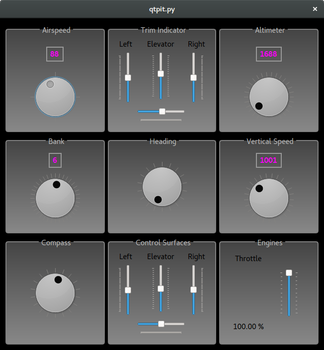
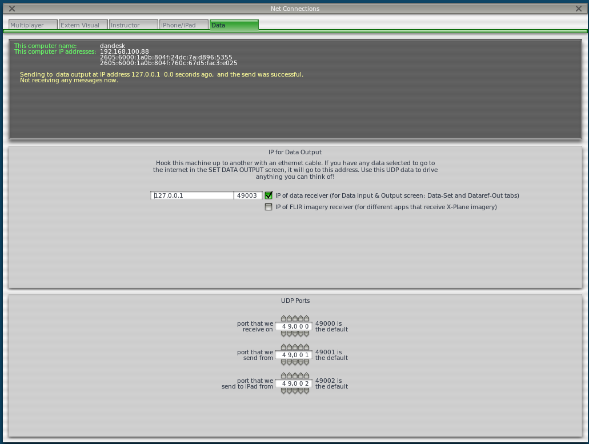
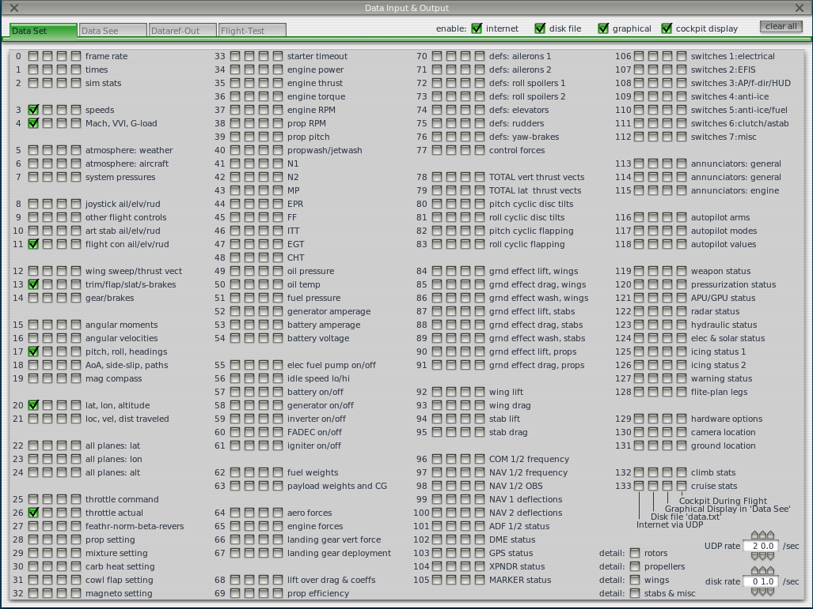

# PyQt-Flight-Sim
Python3 and PyQT5 cockpit for X-Plane

## To Run:
* `git clone https://github.com/dankolbrs/pyqt-flight-sim`
* `cd pyqt-flight-sim`
* `pip install -r requirements.txt`
* Enable datagrams in FlightGear
* `python3 qtpit.py`

## Enabling datagrams in FlightGear
* Settings >> `Net Connections`
  * Ensure `localhost` set to `49003`

* Settings >> `Data Input & Output`
  * Enable the following data sets internet
    * 3 - speeds
    * 4 - Mach, VVI, G-Load
    * 11 - flight con ail/elv/rud
    * 13 - trim/flap/slat/s-brakes
    * 17 - pitch, roll, headings
    * 20 - lat, lon, altitude
    * 26 - throttle actual

## Todos
* Add some AI flying? (Sounds like more fun than just turning on autopilot)
* Convert to X-Plane 11 (when it goes on sale)?
* Library for both X-Plane and FlightGear

## Original
Forked from https://code.google.com/p/pyqt-flight-sim/ via Google Code Import Tool.
License file was created to match License definition of GPLv3.
